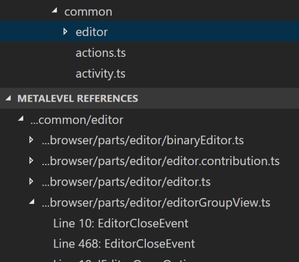

# Metalevel References

This [Visual Studio Code](https://code.visualstudio.com/) extension adds "Find All References" to the file and folder level. It looks at the symbols (currently classes, interfaces, enums, functions) within the selected file or folder and determines where those symbols are used in the rest of the workspace.

The *Metalevel References* extension might come in handy for the following scenarios:

- Understanding how components (modules, packages, ...) depend on each other.
- Determining the impact of bigger refactorings.

## Screenshot

## Features

- "Find All References" at file and folder level via right-click in explorer
- Relies on existing reference and document symbol providers
- Caches provider queries for faster subsequent queries
- Shortens displayed paths by replacing common prefix with `...`

## Requirements

This extension relies on the "Go to Symbol in File" and "Find All References" functionality of the respective target language. If these features are not available for your language, then this extension will not work. With some luck you may find a language extension in the marketplace.

## Known issues

### Incomplete results

Due to the way this extension works the displayed references may be incomplete. One reason is that methods of classes or interfaces are not considered. The reason for that is that method declarations are often inherited from a superclass or interface. Querying references for those methods would then bring many unwanted references to the superclasses and interfaces, and not to the implementing classes.

### Random errors

Sometimes the extension returns with an error without any delay. This can happen when the provider had an issue, most likely this is a bug. Trying again helps in many cases.

## Future ideas

- Group found references not just by file but also folder to get a better overview of high-level dependencies